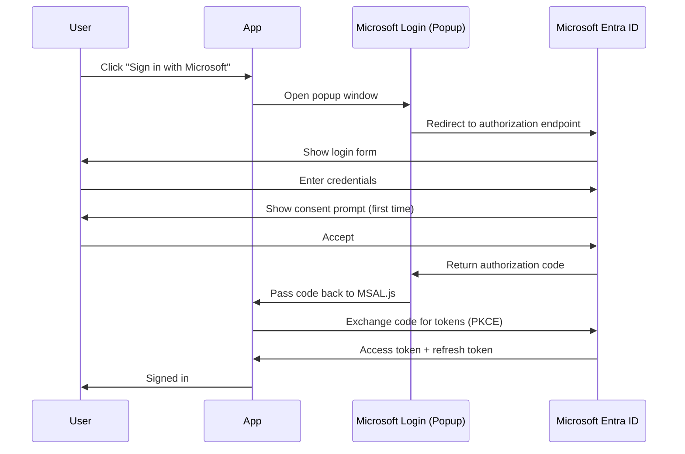

# Authentication

Intune Assignments Manager authenticates users via **Microsoft Entra ID** (formerly Azure AD) using the industry-standard **OAuth2 Authorization Code flow with PKCE**. All authentication is handled client-side by the [MSAL.js](https://github.com/AzureAD/microsoft-authentication-library-for-js) library.

## Sign-in Flow

1. Click the **Sign in with Microsoft** button on the top navigation bar
2. A **popup window** opens to the Microsoft login page (`login.microsoftonline.com`)
3. Enter your work or school account credentials
4. On first sign-in, a **consent prompt** appears listing the permissions the app is requesting (see [Permissions](permissions.md) for details)
5. After you authenticate and grant consent, the popup **closes automatically**
6. The app receives an access token and you are signed in

## Token Management

- **Access tokens** are acquired silently when the app needs to call the Microsoft Graph API. MSAL.js handles caching and automatic renewal.
- **Session persistence**: MSAL caches authentication state in `localStorage`, so you remain signed in across page refreshes and browser restarts within the token's lifetime.
- **Silent renewal**: When an access token expires, MSAL.js automatically attempts to acquire a new one using the cached refresh token -- no user interaction required.
- **Fallback to popup**: If silent renewal fails (e.g. the refresh token has expired or consent is needed for new scopes), the app opens a new popup for re-authentication.

## Incremental Consent

The app uses a **tiered permission model**. Only Tier 1 (core) permissions are requested at sign-in. When you access a feature that requires additional permissions, the app automatically requests them via a new consent popup.

For example, if you navigate to a feature requiring Tier 2 permissions, you will see a consent prompt for just the additional scopes. Previously granted permissions are preserved -- you are never asked to re-consent for scopes you have already approved.

See [Permissions](permissions.md) for the full list of permission tiers and scopes.

## Sign-out

Click your avatar or name in the top navigation bar and select **Sign out**. This:

1. Clears the MSAL token cache in the browser
2. Clears locally stored permission and dashboard data
3. Returns you to the unauthenticated landing page

!!! note "Sign-out is local only"
    Signing out of the app does not sign you out of Microsoft 365 or any other Microsoft service. It only clears the app's local session.

## Security Model

The Intune Assignments Manager is designed with a security-first approach:

| Aspect | Detail |
|---|---|
| **Client-side only** | The app has no server backend. Your credentials and tokens are never sent to any third-party server. |
| **PKCE flow** | The authorization code is protected by a cryptographic code verifier, preventing interception attacks. No client secret is used. |
| **Token storage** | MSAL.js stores tokens in `localStorage` for session persistence. Tokens are scoped to your tenant and the specific permissions you consented to. |
| **Direct API calls** | All Microsoft Graph API calls go directly from your browser to `graph.microsoft.com`. No proxy, no middleware. |
| **No telemetry** | The app does not collect analytics, telemetry, or usage data. |
| **Minimal scopes** | Only the permissions needed for the current operation are requested. |

!!! warning "Browser security"
    Because tokens are stored in the browser, anyone with access to your browser session can access your Intune data. Always sign out when using shared or public computers.
