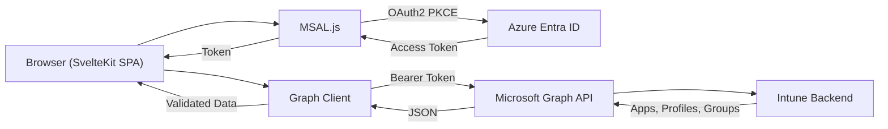
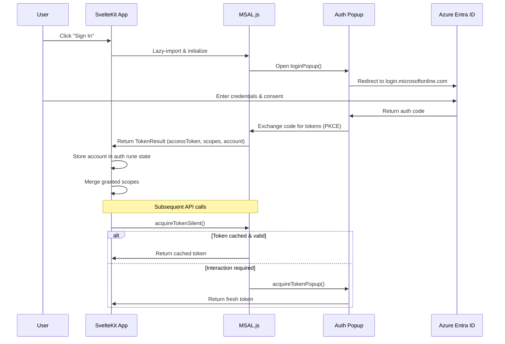
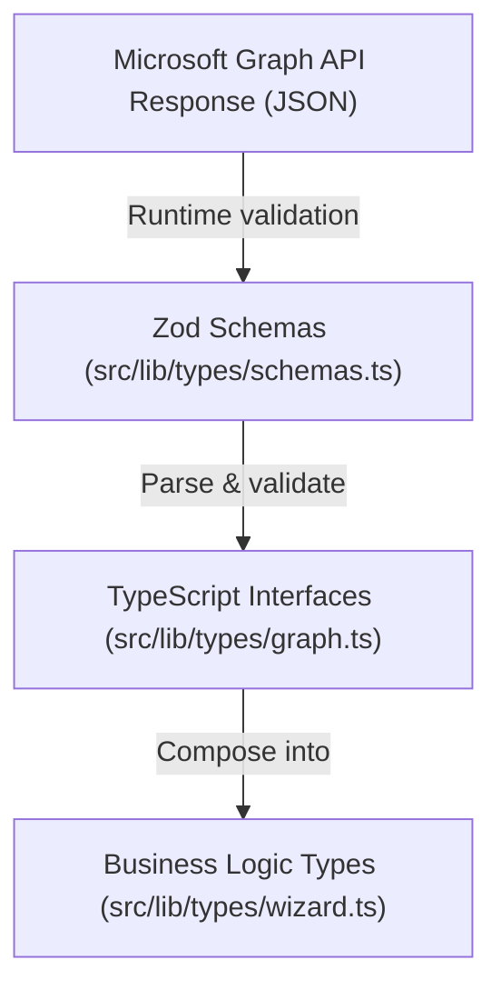
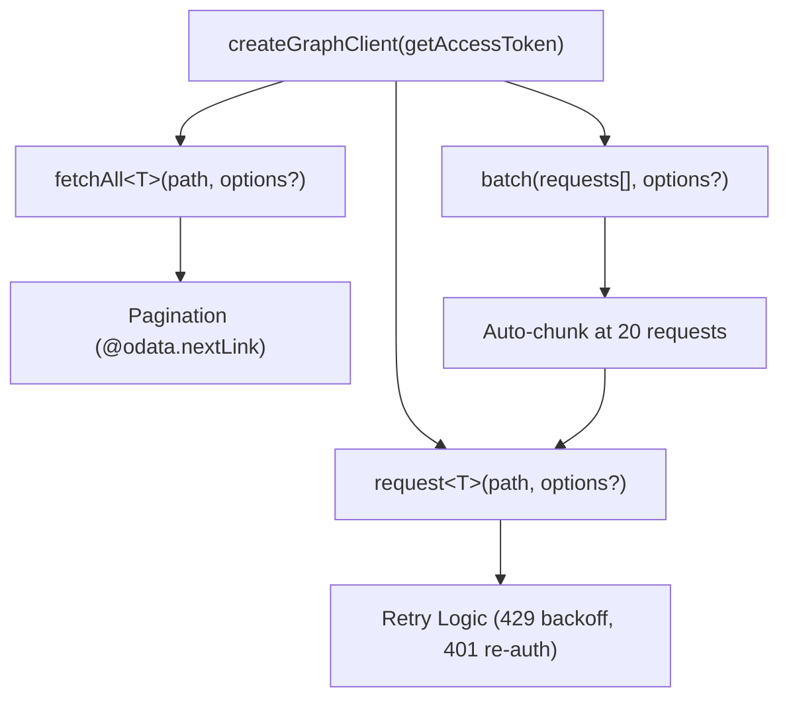
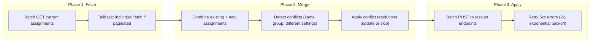

# Architecture

## Overview

The Intune Assignments Manager is a **client-side single-page application** built with SvelteKit 2. There is no server backend — all authentication and API communication happens directly in the browser. The app is deployed to Cloudflare Pages as static assets.

The core data flow is:

1. User authenticates via Microsoft Entra ID using MSAL.js (OAuth2 PKCE popup flow)
2. The app acquires access tokens and calls the Microsoft Graph API directly from the browser
3. Graph API responses are validated with Zod schemas and rendered in the UI

## System Flow

## Authentication Flow

MSAL is lazy-imported on first auth action to maintain SSR-safety (guarded by SvelteKit's `browser` check). See [Authentication](auth.md) for full details.

## Routing

SvelteKit file-based routing provides the following pages:

| Route | Page | Description |
|---|---|---|
| `/` | Dashboard | Overview cards with app/profile counts, recent audit activity |
| `/apps` | App List | Browse all Intune mobile apps with search and filtering |
| `/apps/[id]` | App Detail | View a single app's properties and current assignments |
| `/profiles` | Profile List | Browse all configuration policies with search and filtering |
| `/profiles/[id]` | Profile Detail | View a single profile's properties and current assignments |
| `/assign` | Assignment Wizard | 5-step bulk assignment workflow |
| `/audit` | Audit Log | Browse Intune audit events |
| `/status` | Deployment Status | App install status via Reports API |
| `/settings` | Settings | Permission management and consent controls |

The root layout (`src/routes/+layout.svelte`) wraps all pages with authentication guards, navigation, and theme support.

## State Management

The app uses **pure Svelte 5 runes** for all state management — no external state library (no Redux, no Svelte 4 stores).

Stores live in `src/lib/stores/` and export reactive state via `$state` and `$derived`:

| Store | File | Purpose |
|---|---|---|
| Auth | `auth.svelte.ts` | Current account, authentication state, granted scopes |
| Notifications | `notifications.svelte.ts` | Toast notification queue (success, error, info) |
| Theme | `theme.svelte.ts` | Dark/light mode preference |
| Permissions | `permissions.svelte.ts` | Granted scopes, consent error tracking |
| Shortcuts | `shortcuts.svelte.ts` | Keyboard shortcut registry |
| Command Palette | `command-palette.svelte.ts` | Command palette open/close state |
| Dashboard Cache | `dashboard-cache.svelte.ts` | Cached app/profile counts and recent activity |
| Filter Cache | `filter-cache.ts` | Cached assignment filter definitions |
| Group Cache | `group-cache.ts` | Cached group name resolutions |
| Graph Client | `graph.ts` | Singleton graph client instance |

## Three-Tier Type System

The codebase uses a layered approach to type safety:

1. **TypeScript interfaces** (`src/lib/types/graph.ts`) define the shape of Graph API response objects — `MobileApp`, `ConfigurationPolicy`, `MobileAppAssignment`, etc.

2. **Zod schemas** (`src/lib/types/schemas.ts`) provide runtime validation when parsing API responses. The `fetchAll` method uses schemas to validate each page of results.

3. **Business logic types** (`src/lib/types/wizard.ts`) compose Graph types into higher-level abstractions — `AssignableItem`, `GroupTarget`, `ConflictChoice`, `AssignmentResult`, etc.

Additional type files:

- `src/lib/types/diff.ts` — Assignment diff types for comparing before/after states
- `src/lib/types/status.ts` — Status and reports types
- `src/lib/types/status-schemas.ts` — Zod schemas for Reports API responses

## Graph API Client Architecture

The Graph client is a factory function that returns three methods:

- **`request<T>()`** — Single HTTP request with automatic retry: exponential backoff on 429 (rate limit), one re-auth attempt on 401
- **`fetchAll<T>()`** — Paginated fetch that follows `@odata.nextLink` up to a configurable page limit (default 50)
- **`batch()`** — Sends requests to the `/$batch` endpoint, auto-chunks at 20 requests per batch, retries individual 429 responses

All three methods default to the **beta** Graph API endpoint (`https://graph.microsoft.com/beta`). Pass `version: 'v1.0'` to use the stable endpoint.

See [Graph API Client](graph-client.md) for the full deep dive.

## Bulk Assignment Execution Flow

The bulk assignment wizard uses a three-phase execution model in `src/lib/graph/execute.ts`:

!!! warning "Replace semantics"
    The Graph API `assign` endpoint **replaces all assignments** for an item. Existing assignments must always be fetched and merged first to avoid accidentally removing assignments that were not part of the current operation.

### Merge Logic

The merge module (`src/lib/graph/merge.ts`) uses a target-key approach:

1. Index existing assignments by a deterministic key (e.g., `group::{groupId}`, `exclusion::{groupId}`, `allDevices`, `allUsers`)
2. For each new assignment, check if that target key already exists
3. If a conflict is found, apply the user's resolution choice: **update** (overwrite) or **skip** (keep existing)
4. Return the full merged list to POST back to the API

## Caching Strategy

| Data | Storage | TTL | Invalidation |
|---|---|---|---|
| Dashboard counts (apps, profiles, assigned) | `localStorage` | 15 minutes | Manual refresh, list page loads |
| Recent audit activity | `localStorage` | 15 minutes | Bundled with dashboard cache |
| Assignment filter definitions | In-memory (module scope) | Session lifetime | `clearFilterCache()` |
| Group name resolutions | In-memory (`Map`) | Session lifetime | `clearGroupCache()` |
| MSAL tokens | `localStorage` (MSAL-managed) | Token lifetime | MSAL handles refresh automatically |
| Granted scopes | `localStorage` | Until sign-out | Cleared on logout |
