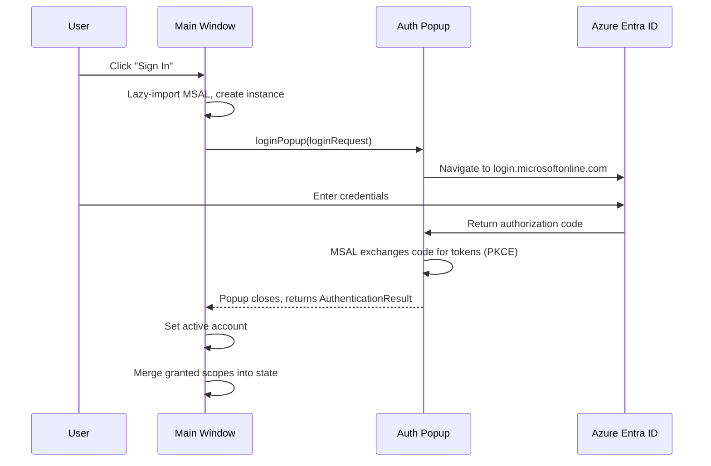

# Authentication

Authentication is handled entirely client-side using Microsoft's MSAL.js library (`@azure/msal-browser`). The implementation lives in `src/lib/auth/` with reactive state managed by Svelte runes in `src/lib/stores/auth.svelte.ts`.

## MSAL Lazy-Loading

MSAL is **not** imported at module load time. Instead, it is dynamically imported on first use:

```typescript
// src/lib/stores/auth.svelte.ts
export async function login(): Promise<void> {
    if (!browser) return;

    const { signIn } = await import('$lib/auth/msal');
    const result = await signIn();
    // ...
}
```

This is required for **SSR safety**. SvelteKit pre-renders pages on the server where browser APIs (`window`, `localStorage`, `BroadcastChannel`) are unavailable. The `browser` guard from `$app/environment` prevents any MSAL code from executing during SSR.

The MSAL instance itself is lazily created via `createStandardPublicClientApplication()` and cached as a module-level singleton:

```typescript
// src/lib/auth/msal.ts
let msalInstance: IPublicClientApplication | null = null;
let initPromise: Promise<IPublicClientApplication> | null = null;

export async function getOrCreateMsalInstance(): Promise<IPublicClientApplication> {
    if (msalInstance) return msalInstance;

    if (!initPromise) {
        initPromise = createStandardPublicClientApplication(msalConfig).then((instance) => {
            msalInstance = instance;
            return instance;
        });
    }

    return initPromise;
}
```

The `initPromise` pattern ensures that concurrent calls during initialization don't create multiple instances.

## MSAL Configuration

Defined in `src/lib/auth/config.ts`:

```typescript
export const msalConfig: Configuration = {
    auth: {
        clientId: PUBLIC_ENTRA_CLIENT_ID,
        authority: 'https://login.microsoftonline.com/common',
        redirectUri: typeof window !== 'undefined'
            ? window.location.origin
            : 'http://localhost:5173',
        postLogoutRedirectUri: typeof window !== 'undefined'
            ? window.location.origin
            : 'http://localhost:5173'
    },
    cache: {
        cacheLocation: 'localStorage'
    }
};
```

Key configuration choices:

- **Authority**: `common` allows any Microsoft Entra ID tenant to sign in (multi-tenant)
- **Cache location**: `localStorage` so tokens survive page refreshes and browser restarts
- **Redirect URI**: Dynamic — uses `window.location.origin` in the browser, falls back to `localhost:5173` for SSR safety

## Login Flow

The login flow uses `loginPopup()`, which opens a popup window for authentication:



The `loginRequest` specifies Tier 1 scopes only:

```typescript
export const loginRequest = {
    scopes: ['User.Read', 'DeviceManagementApps.ReadWrite.All',
             'DeviceManagementConfiguration.ReadWrite.All', 'Group.Read.All']
};
```

If the user cancels the popup (`BrowserAuthErrorCodes.userCancelled`), the function returns `null` silently rather than throwing.

## Token Acquisition

After initial sign-in, API calls need fresh tokens. The `acquireToken()` function handles this:

```typescript
export async function acquireToken(scopes: string[]): Promise<TokenResult> {
    const instance = await getOrCreateMsalInstance();
    const account = instance.getActiveAccount();

    try {
        // Try silent first (uses cached token or refresh token)
        const result = await instance.acquireTokenSilent({ scopes, account });
        return { accessToken: result.accessToken, scopes: result.scopes, account: result.account };
    } catch (error) {
        if (error instanceof InteractionRequiredAuthError) {
            // Silent failed — show popup for re-consent
            const result = await instance.acquireTokenPopup({ scopes, account });
            return { accessToken: result.accessToken, scopes: result.scopes, account: result.account };
        }
        throw error;
    }
}
```

The acquisition strategy:

1. **`acquireTokenSilent()`** — Uses the MSAL cache (in localStorage). If the access token is expired, MSAL uses the refresh token to get a new one silently.
2. **Fallback to `acquireTokenPopup()`** — If silent acquisition fails with `InteractionRequiredAuthError` (e.g., consent needed for new scopes, MFA required, refresh token expired), a popup is shown.

The Graph client uses `getAccessToken()` which wraps `acquireToken()` with the default Tier 1 scopes:

```typescript
export async function getAccessToken(): Promise<string> {
    const result = await acquireToken([...graphScopes]);
    return result.accessToken;
}
```

## Incremental Consent

The app supports **incremental consent** — requesting additional permissions beyond Tier 1 only when a feature requires them. This is handled by `getTokenWithScopes()` in the auth store and `requestConsent()` in the permission-check module:

```typescript
// src/lib/auth/permission-check.ts
export async function requestConsent(scopes: string[]): Promise<boolean> {
    if (!browser) return false;
    if (scopes.length === 0) return true;
    if (hasAllScopes(scopes)) return true;

    try {
        await getTokenWithScopes(scopes);
        return hasAllScopes(scopes);
    } catch (err) {
        console.error('Consent request failed:', err);
        return false;
    }
}
```

The flow:

1. Check if the required scopes have already been granted (`hasAllScopes`)
2. If not, call `getTokenWithScopes()` which attempts silent acquisition first
3. If interaction is required, MSAL shows a consent popup for just the new scopes
4. Newly granted scopes are merged into the cumulative scope set

!!! note "Scope accumulation"
    MSAL returns only the scopes for the specific resource requested, not all previously granted scopes. The auth store maintains a cumulative union of all granted scopes across all `acquireToken` calls, persisted to `localStorage` under the key `intune-granted-scopes`.

## Permission Tiers

Scopes are organized into four tiers, defined in `src/lib/auth/config.ts` and described in `src/lib/auth/permissions.ts`:

| Tier | Name | Scopes | Features |
|---|---|---|---|
| 1 | Core | `User.Read`, `DeviceManagementApps.ReadWrite.All`, `DeviceManagementConfiguration.ReadWrite.All`, `Group.Read.All` | Dashboard, Apps, Profiles, Assign, Audit |
| 2 | Device Management | `DeviceManagementManagedDevices.Read.All` | Device inventory and compliance |
| 3 | Device Actions | `DeviceManagementManagedDevices.ReadWrite.All` | Sync, restart, retire devices |
| 4 | Autopilot | `DeviceManagementServiceConfig.Read.All` | Autopilot enrollment data |

Tier 1 scopes are requested at sign-in. Higher tiers are requested via incremental consent when the user navigates to a feature that requires them.

### Feature-to-scope mapping

The `getRequiredScopes(feature)` function maps route prefixes to the additional scopes they require:

```typescript
const FEATURE_PERMISSIONS: Record<string, readonly string[]> = {
    '/devices/actions': [...TIER_3_SCOPES],
    '/devices': [...TIER_2_SCOPES],
    '/autopilot': [...TIER_4_SCOPES]
};
```

Routes not listed only need Tier 1 scopes (already granted at sign-in). Entries are sorted by specificity (longest prefix first) so `/devices/actions` matches before `/devices`.

### PermissionTier type

```typescript
interface PermissionTier {
    id: number;
    name: string;
    description: string;
    scopes: readonly string[];
    features: string[];
}
```

The `PERMISSION_TIERS` array and helper functions (`getTierForScope`, `getTierById`) are available from `src/lib/auth/permissions.ts` for building consent UIs.

## Auth Store

The auth store (`src/lib/stores/auth.svelte.ts`) is the central reactive state for authentication:

### Reactive state

```typescript
import { auth } from '$lib/stores/auth.svelte';

// Read-only reactive properties
auth.account        // AccountInfo | null
auth.isAuthenticated // boolean (derived)
auth.isInitializing  // boolean
auth.error           // string | null
auth.grantedScopes   // string[]
```

### Actions

| Function | Description |
|---|---|
| `initAuth()` | Initialize MSAL, restore session from cache. Called once in root layout. |
| `login()` | Open login popup, store account and scopes on success. |
| `logout()` | Open logout popup, clear account and scopes. |
| `getToken()` | Get access token for Tier 1 scopes (used by Graph client). |
| `getTokenWithScopes(scopes)` | Get access token with specific scopes, handling incremental consent. |

### Initialization

The root layout calls `initAuth()` on mount:

```svelte
<script>
    import { initAuth } from '$lib/stores/auth.svelte';
    import { browser } from '$app/environment';

    if (browser) {
        initAuth();
    }
</script>
```

This restores any existing session from MSAL's localStorage cache without showing a popup. If a cached account is found, the user is immediately authenticated.

## Scope Descriptions

Human-readable descriptions for all scopes are available for building consent UIs:

```typescript
import { SCOPE_DESCRIPTIONS } from '$lib/auth/permissions';

SCOPE_DESCRIPTIONS['User.Read']
// "Sign in and read your profile"

SCOPE_DESCRIPTIONS['DeviceManagementApps.ReadWrite.All']
// "Read and write Intune app configurations"
```
